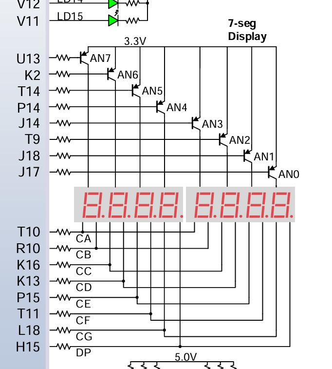

## 1. 相关引脚



| **信号类型**     | **引脚标号** | **对应功能**                                                 |
| ---------------- | ------------ | ------------------------------------------------------------ |
| **位选控制输入** | U13          | 控制**AN7位选三极管**（最左边）的基极，选通**第7位数码管**（共阳公共端接3.3V） |
|                  | K2           | 控制**AN6位选三极管**的基极，选通**第6位数码管**             |
|                  | T14          | 控制**AN5位选三极管**的基极，选通**第5位数码管**             |
|                  | P14          | 控制**AN4位选三极管**的基极，选通**第4位数码管**             |
|                  | J14          | 控制**AN3位选三极管**的基极，选通**第3位数码管**             |
|                  | T9           | 控制**AN2位选三极管**的基极，选通**第2位数码管**             |
|                  | J18          | 控制**AN1位选三极管**的基极，选通**第1位数码管**             |
|                  | J17          | 控制**AN1位选三极管**的基极，选通**第0位数码管**             |
| **段选控制输入** | T10          | A                                                            |
|                  | R10          | B                                                            |
|                  | K16          | C                                                            |
|                  | K13          | D                                                            |
|                  | P15          | E                                                            |
|                  | T11          | F                                                            |
|                  | L18          | G                                                            |
|                  | H15          | 小数点                                                       |

直接配置:

```verilog
set_property IOSTANDARD LVCMOS33 [get_ports {Seg_Display_LED[7]}]
set_property IOSTANDARD LVCMOS33 [get_ports {Seg_Display_LED[6]}]
set_property IOSTANDARD LVCMOS33 [get_ports {Seg_Display_LED[5]}]
set_property IOSTANDARD LVCMOS33 [get_ports {Seg_Display_LED[4]}]
set_property IOSTANDARD LVCMOS33 [get_ports {Seg_Display_LED[3]}]
set_property IOSTANDARD LVCMOS33 [get_ports {Seg_Display_LED[2]}]
set_property IOSTANDARD LVCMOS33 [get_ports {Seg_Display_LED[1]}]
set_property IOSTANDARD LVCMOS33 [get_ports {Seg_Display_LED[0]}]
set_property IOSTANDARD LVCMOS33 [get_ports {Seg_EN[7]}]
set_property IOSTANDARD LVCMOS33 [get_ports {Seg_EN[6]}]
set_property IOSTANDARD LVCMOS33 [get_ports {Seg_EN[5]}]
set_property IOSTANDARD LVCMOS33 [get_ports {Seg_EN[4]}]
set_property IOSTANDARD LVCMOS33 [get_ports {Seg_EN[3]}]
set_property IOSTANDARD LVCMOS33 [get_ports {Seg_EN[2]}]
set_property IOSTANDARD LVCMOS33 [get_ports {Seg_EN[1]}]
set_property IOSTANDARD LVCMOS33 [get_ports {Seg_EN[0]}]
set_property IOSTANDARD LVCMOS33 [get_ports clk]
set_property IOSTANDARD LVCMOS33 [get_ports Reset_n]

set_property PACKAGE_PIN E3 [get_ports clk]
set_property PACKAGE_PIN J15 [get_ports Reset_n]
set_property PACKAGE_PIN T10 [get_ports {Seg_Display_LED[0]}]
set_property PACKAGE_PIN R10 [get_ports {Seg_Display_LED[1]}]
set_property PACKAGE_PIN K16 [get_ports {Seg_Display_LED[2]}]
set_property PACKAGE_PIN K13 [get_ports {Seg_Display_LED[3]}]
set_property PACKAGE_PIN P15 [get_ports {Seg_Display_LED[4]}]
set_property PACKAGE_PIN T11 [get_ports {Seg_Display_LED[5]}]
set_property PACKAGE_PIN L18 [get_ports {Seg_Display_LED[6]}]
set_property PACKAGE_PIN H15 [get_ports {Seg_Display_LED[7]}]
set_property PACKAGE_PIN J17 [get_ports {Seg_EN[0]}]
set_property PACKAGE_PIN J18 [get_ports {Seg_EN[1]}]
set_property PACKAGE_PIN T9 [get_ports {Seg_EN[2]}]
set_property PACKAGE_PIN J14 [get_ports {Seg_EN[3]}]
set_property PACKAGE_PIN P14 [get_ports {Seg_EN[4]}]
set_property PACKAGE_PIN T14 [get_ports {Seg_EN[5]}]
set_property PACKAGE_PIN K2 [get_ports {Seg_EN[6]}]
set_property PACKAGE_PIN U13 [get_ports {Seg_EN[7]}]
```


==**写参数千万记得!!!声明位数!!!**==


